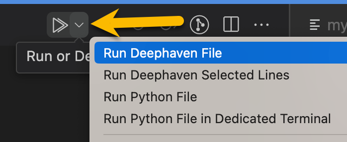
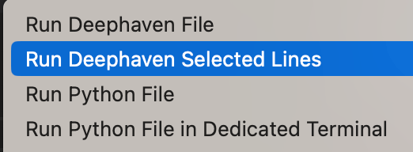

# dh-in-vscode

Deephaven in VS Code

- Run Python dh scripts from vscode against a running DH core server
  - Run all
  - Run selected code
- View output in vscode panels
- View output in DH panels (depends on [pr#1925](https://github.com/deephaven/web-client-ui/pull/1925) to automatically update panels)


## Installation

This extension is not yet published to the marketplace, but you can install a `.vsix` directly. To get a `.vsix`, you can either:

Download one from the [releases/](releases/) folder.

or

Build a .vsix locally via `npm run package`

Then install in vscode:


## Connecting to a Server

Core server `http://localhost:10000/` is configured by default and doesn't require any additional config. Additional connections can be configured in `vscode` settings.

e.g. `.vscode/settings.json`

```jsonc
{
  // Core servers
  "dh-in-vscode.core-servers": [
    "http://localhost:10000/",
    "http://localhost:10001"
  ],
  // Enterprise servers
  "dh-in-vscode.enterprise-servers": [
    "https://some-dhe-server:8123/",
    "https://some-other-server:8124"
  ]
}
```

To select the active connection that scripts will be run against, click the connection picker in the bottom status bar of vscode.

> Note: If you don't select a connection, the first one will be automatically used the first time a script is run.


Then select one of the servers:


## Running Scripts

Scripts will be run against the active connection or default to the first connection if none is selected.

1. Start a DH core server at http://localhost:1000
2. Open a DH Python script in vscode
3. Click the caret on the `Run` button in the top right of the editor and select `Run Deephaven File`

   

Note that `vscode` will remember your selection so you can just click the `run` button (play icon) the next time.

### Run a selection

1. Select text to run
2. Click the caret on the `Run` button in the top right of the editor and select `Run Deephaven Selected Lines`

   

Note that `vscode` will remember your selection so you can just click the `run` button (play icon) the next time.

## Code Snippets

The `dh-in-vscode` extension comes with some predefined `python` snippets. These insert pre-defined code snippets into an editor. To use, simply type `ui` to see available snippets.


## Implementation Notes

### Server Connection

### DHC

The first time a connection is made to a `DHC` server, the extension will:

1. Download the JS API from the server
2. Check server auth config. If anonymous, connect anonymously. If `PSK` prompt for `PSK`.

If auth succeeds and connection was initiated by running a script:

1. Run the script against the server
2. Update panels in vscode and deephaven.

On subsequent script runs, the session will be re-used and only steps 4 and 5 will run

### DHE

1. Download the JS API from the server
2. Prompt the user to authenticate (or will pull from env variables)
3.

### Downloading JS API

The extension dynamically downloads and loads the DH JS API from a DH Core server.

- `src/jsApi.downloadDhFromServer()`
  At runtime, `dh-internal.js` and `dh-core.js` are downloaded from the running DH server (default http://localhost:10000). The files are saved to `out/tmp` as `.cjs` modules, and import / export are converted to cjs compatible ones.

### TODO

- https://github.com/deephaven/web-client-ui/pull/1925 - allow panels to update in DH when commands are sent from extension
- Finish DHE fs apis
- Fix hack for waiting on rename
- Auto update dhfs if files change on server
- Settings
  - Enable / disable DHE
  - Enable / diable panels
  - Enable / disable DHE FS
- Auto connect to server option?
- Mocking partial browser apis breaks other extensions
- Make sure DH subscriptions are properly cleaned up
- Need to detect invalid connection if server restarts (presumably other scenarios as well)
- Split out PanelService
