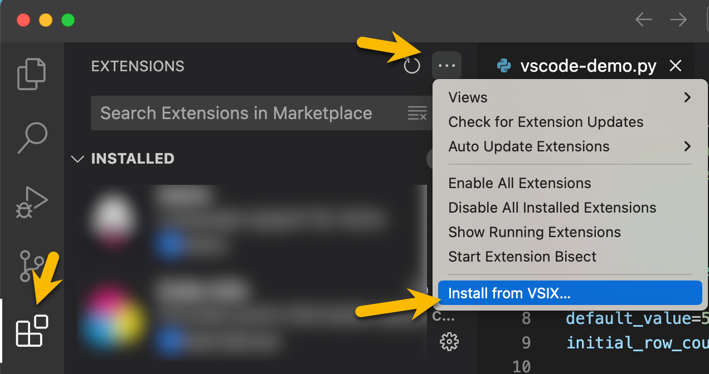

# dh-in-vscode

Deephaven in VS Code

- Run Python dh scripts from vscode against a running DH core server
  - Run all
  - Run selected code
- View output in vscode (depends on `embed-widget` which currently doesn't support `Deephaven UI` but does support tables and charts)
- View output in DH (depends on [pr#1925](https://github.com/deephaven/web-client-ui/pull/1925) to automatically update panels)

## Installation

This extension is not yet published to the marketplace, but you can install a `.vsix` directly. To get a `.vsix`, you can either:

Download one from the [releases/](releases/) folder.

or

Build a .vsix locally via `npm run package`

Then install in vscode:

## Server Connection

The first time a script is run in an open workspace, the extension will:

1. Download the JS API from the server
2. Attempt to authenticate anonymously
3. If anonymous auth fails, prompt for `PSK`
4. If either 3 or 4 succeeds, run the script against the server
5. Update panels in vscode an deephaven

On subsequent script runs, the session will be re-used and only steps 4 and 5 will run

## Running Scripts

1. Start a DH core server at http://localhost:1000
2. Open a DH Python script in vscode
3. Click the `Deephaven: Run` button in the top right of the editor

   

### Run a selection

1. Select text to run
2. Should see new button appear in top right

   

## Implementation Notes

### Downloading JS API

The extension dynamically downloads and loads the DH JS API from a DH Core server.

- `src/jsApi.downloadDhFromServer()`
  At runtime, `dh-internal.js` and `dh-core.js` are downloaded from the running DH server (default http://localhost:10000). The files are saved to `out/tmp` as `.cjs` modules, and import / export are converted to cjs compatible ones.

### TODO

- https://github.com/deephaven/web-client-ui/pull/1925 - allow panels to update in DH when commands are sent from extension
- Support server url configuration
- embed-widget to support Deephaven UI
- better panel layout support (this is limited by vscode apis)
- open workspace folder from server
